Mehdi Meguenani TP4

# Exercice 1. Commandes de base

### 1. Commencez par mettre à jour votre système avec les commandes vues dans le cours.
Afin de mettre a jour le système il faut effectuer 
```
apt update ; apt upgrade 
```

### 2. Créez un alias “maj” de la ou des commande(s) de la question précédente. Où faut-il enregistrer cet alias pour qu’il ne soit pas perdu au prochain redémarrage ?

Afin de créer un alias des commandes qui permettents de mettre a jour le système il faut effectuer la commande :
```
alias maj='sudo apt-get update && apt-get upgrade'
```
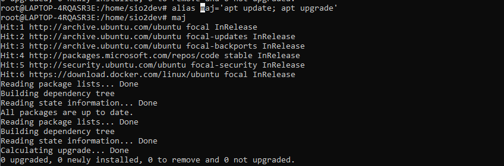

Pour que la commande soit enregistré il faut l'écrire dans le .bashrc

### 3. Utilisez le fichier /var/log/dpkg.log pour obtenir les 5 derniers paquets installés sur votre machine.

Pour obtenir les 5 derniers paquets installés sur la machine il faut effectuer la commande : 
```
 grep "installed" /var/log/dpkg.log | tail -n5
```
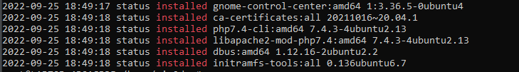

### 4. Listez les derniers paquets qui ont été installés explicitement avec la commande apt install
Pour lister les derniers paquets installés avec apt install il faut utiliser la commande : 
```
grep "apt install" /var/log/apt/history.log
```
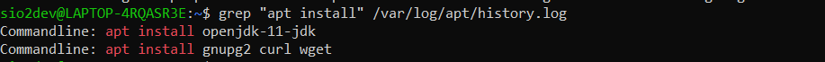

### 5. Utilisez les commandes dpkg et apt pour compter de deux manières différentes le nombre de total de paquets installés sur la machine (ne pas hésiter à consulter le manuel !). Comment explique-t-on la (petite) différence de comptage ? Pourquoi ne peut-on pas utiliser directement le fichier dpkg.log ?

Pour compter le nombre total de paquet avec la commande dpkg il faut utilisert la commlande ``` dpkg -l | grep "ii" | wc -l  ``` on obtient 1626 
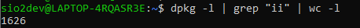


Pour compter le nombre total de paquet avec la commande apt il faut utilisert la commande ``` apt list --installed | wc -l ``` on obtient 1627 : 

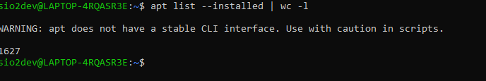


### 6. Combien de paquets sont disponibles en téléchargement sur les dépôts Ubuntu ?
Afin de calculer le nombre de paquet disponible en téléchargement sur les dépots il faut faire ``` apt list | wc -l ``` il y a 75363 paquet disponible :
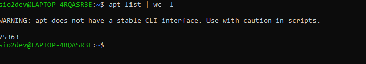

### 7. A quoi servent les paquets glances, tldr et hollywood ? Installez-les et testez-les.

Glances permet d'afficher l'état des principales ressources d'un système, de sa charge et du fonctionnement des applications. Pour l'installer il faut avoir python et installer le paquet via la commande ``` sudo pip3 install glances ``` 

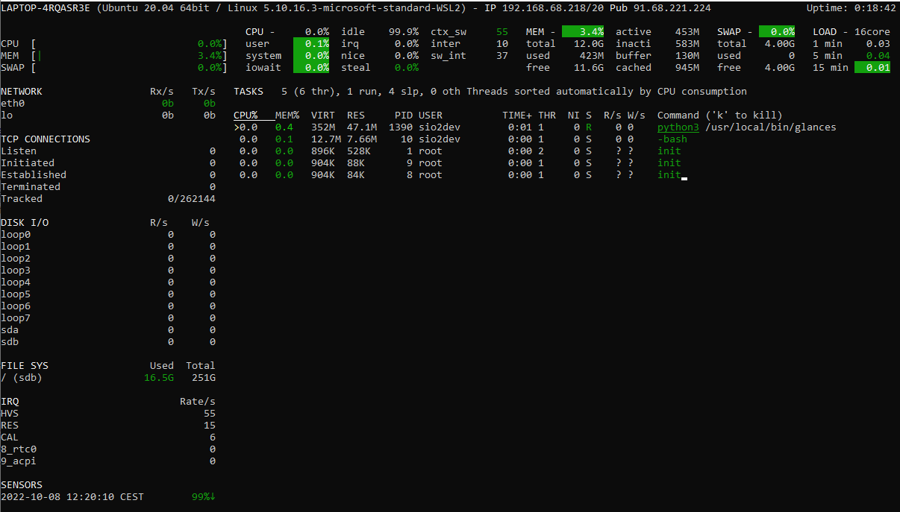
Le paquet tldr permet de résumées  des pas ges de manuel par des exemples dans Ubuntu. Il faut utiliser la commande ``` sudo npm install -g tldr ```


Le paquet Hollywod permet de simuler une fenêtre de hacking. Pour l'installer utiliser la commande 

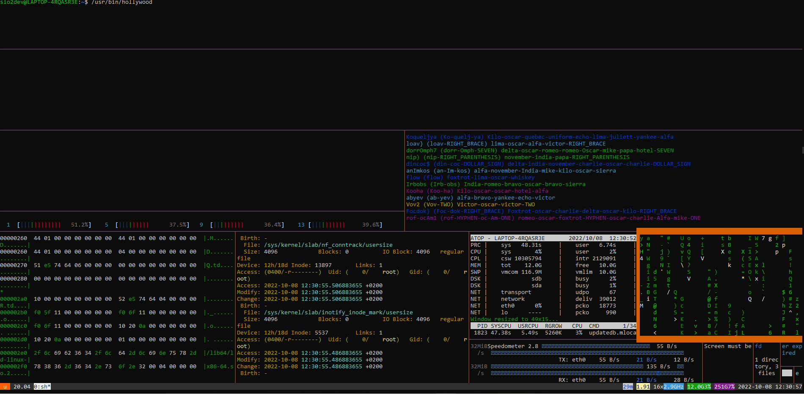
### 8. Quels paquets proposent de jouer au sudoku ?

Les paquet ksudoku ou gnome-sudoku permette d'insallert le sudoku .

# Exercice 2.

### A partir de quel paquet est installée la commande ls ? Comment obtenir cette information en une seule commande, pour n’importe quel programme ? Utilisez la réponse à cette question pour écrire un script appelé origine-commande (sans l’extension .sh) prenant en argument le nom d’une commande, et indiquant quel paquet l’a installée.

Afin de trouver depuis quelle paquet est installé ls il faut effectuer la commande ``` dpkg -S ls | grep "/ls$" ```

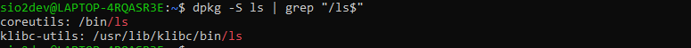

Pour obtenir cette information en une seule commande pour n'importe quelle programme il faut faire la commande  ``` which -a ls | xargs dpkg -S 2>/dev/null | cut -f1 -d: ```

Le script pour effectuer cela est : 

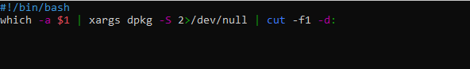
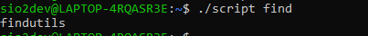


# Exercice 3.

### Ecrire une commande qui affiche “INSTALLÉ” ou “NON INSTALLÉ” selon le nom et le statut du package spécifié dans cette commande.

Afin d'afficher selon nom du package si il est installé il faut effectuer la commande ``` dpkg -l "Package" | grep "ii" && echo "Installé" || echo "Non Installé" ```

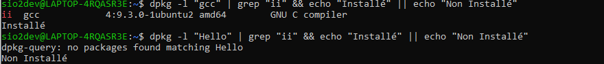

# Exercice 4.
### Lister les programmes livrés avec coreutils. En particulier, on remarque que l’un deux se nomme [ . De quoi s’agit-il ?

Pour afficher les progammes livré avec coreutils, il faut faire la commande ``` dpkg -L coreutils ```

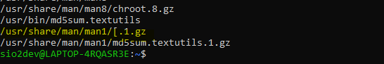

# Exercice 5. aptitude

### Installez les paquets emacs et lynx à l’aide de la version graphique d’aptitude (et prenez deux minutes pour vous renseigner et tester ces paquets).

Lynx est un navigateurs web en mode texte utilisable via une console ou un terminal. Pour l'installer il faut effectuer la commande ``` sudo apt install lynx ``` dans le prochain nous somme sur la page web de wikipedia : 
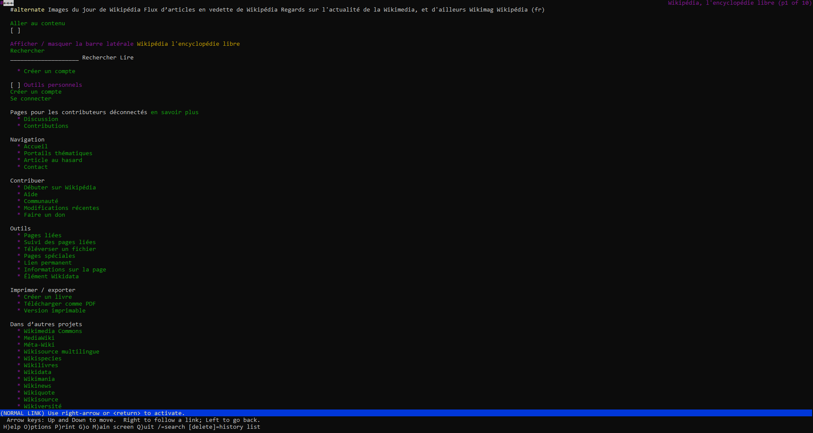

Emacs est un éditeur de texte puissant qui peut servir d'environement de langage pour beaucoup de langage 


# Exercice 6. Installation d’un paquet par PPA

### 1. Installer la version Oracle de Java (avec l’ajout des PPA)

La commande qui permet d'installer oracle Java avec l'ajout des PPA est ``` sudo add-apt-repository -y ppa:webupd8team/java && sudo apt-get update && sudo apt-get install -y oracle-java8-installer ```

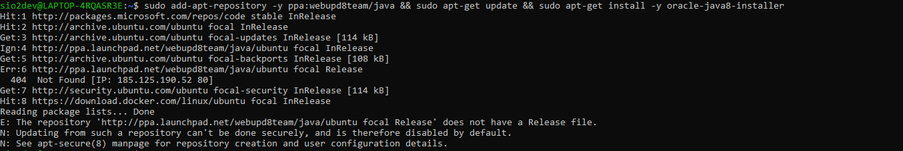

### 2. Vérifiez qu’un nouveau fichier a été créé dans /etc/apt/sources.list.d. Que contient-il ?

Le dossier source.list.d contient les sources utilisés pour installer les paquets 
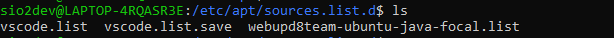

# Exercice 7. Installation d’un logiciel à partir du code source

### 1. Commencez par cloner le dépôt git suivant : git clone https://gitlab.com/jallbrit/cbonsai

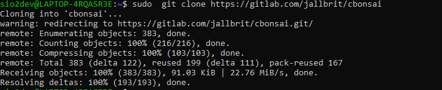

### 2. Rendez vous dans le dossier cbonsai. Un fichier README.md) est livré avec les sources, et vous explique comment compiler le programme. 

Il faut installer le paquet ``` sudo apt install libncursesw5-dev ```
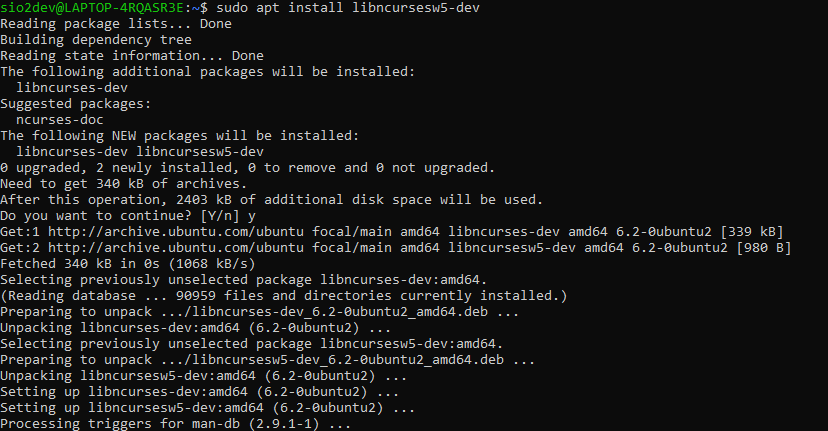

Une fois toute les étapes fini on obtient cela : 

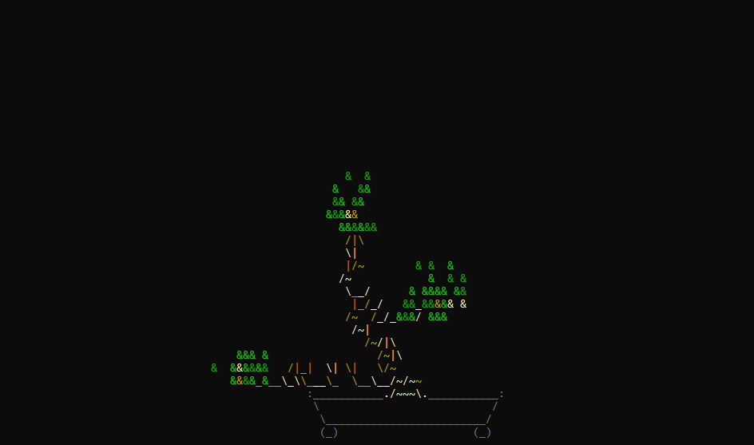

# Exercice 8. Création de dépôt personnalisé

### 1. Dans le dossier scripts créé lors du TP 2, créez un sous-dossier origine-commande où vous créerez un sous-dossier DEBIAN, ainsi que l’arborescence usr/local/bin où vous placerez le script écrit à l’exercice 2

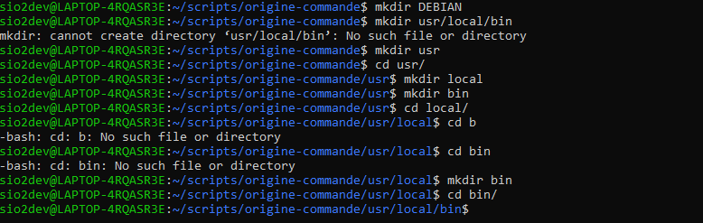

### 2. Dans le dossier DEBIAN, créez un fichier control avec les champs suivants :
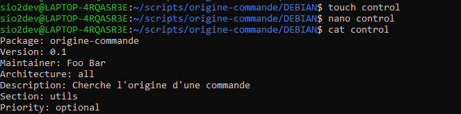
## Création du dépôt personnel avec reprepro

### 1. Dans votre dossier personnel, commencez par créer un dossier repo-cpe. Ce sera la racine de votre dépôt
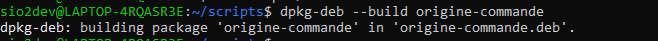

### 2. Ajoutez-y deux sous-dossiers : conf (qui contiendra la configuration du dépôt) et packages (qui contiendra nos paquets)
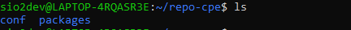 

### 3. Dans conf, créez le fichier distributions suivant :
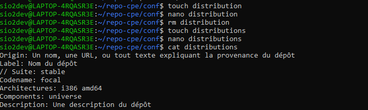

### 4. Dans le dossier repo-cpe, générez l’arborescence du dépôt avec la commande
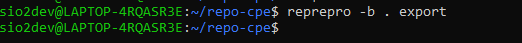

### 5. Copiez le paquet origine-commande.deb créé précédemment dans le dossier packages du dépôt, puis, à la racine du dépôt, exécutez la commande ``` reprepro -b . includedeb cosmic origine-commande.deb ```

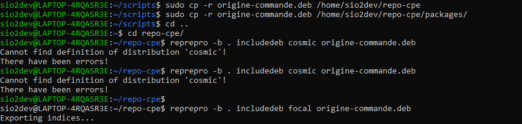
### 6. Il faut à présent indiquer à apt qu’il existe un nouveau dépôt dans lequel il peut trouver des logiciels. Pour cela, créez (avec sudo) dans le dossier /etc/apt/sources.list.d le fichier repo-cpe.list contenant : ``` deb file:/home/VOTRE_NOM/repo-cpe cosmic multiverse ```
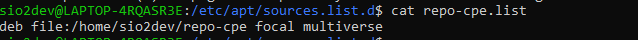
### 7. Lancez la commande sudo apt update
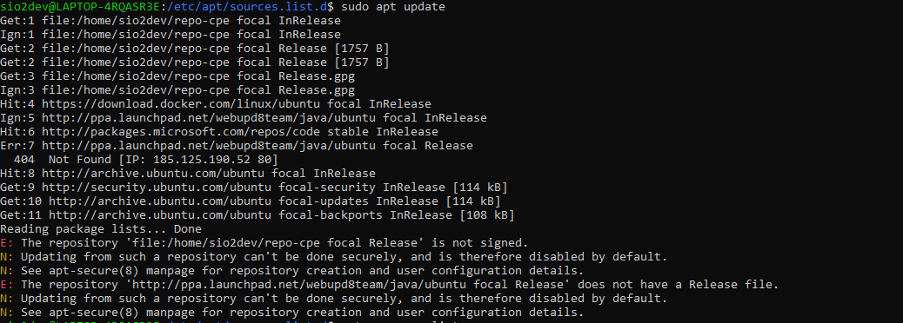

## Signature du dépôt avec GPG
# 1. Commencez par créer une nouvelle paire de clés avec la commande
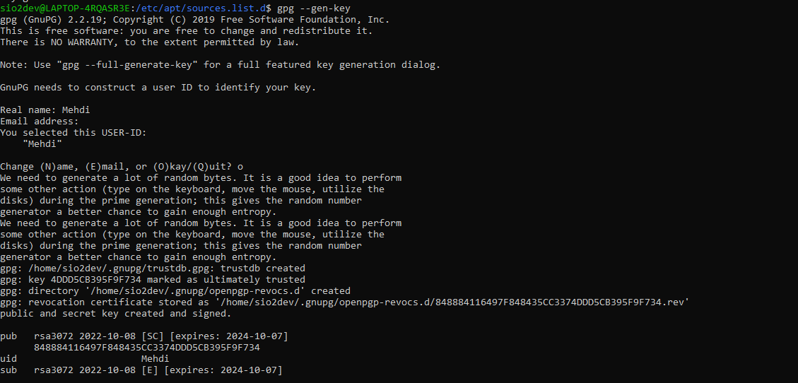

# 2. Ajoutez à la configuration du dépôt (fichier distributions la ligne suivante :

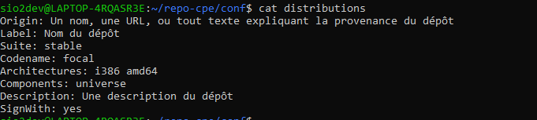
# 3. Ajoutez la clé à votre dépôt 
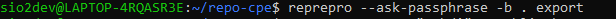

# 4. Ajoutez votre clé publique à votre dépôt avec la commande
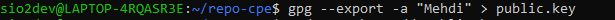

# 5. Enfin, ajoutez cette clé à la liste des clés fiables connues de apt :

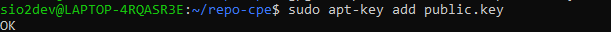

